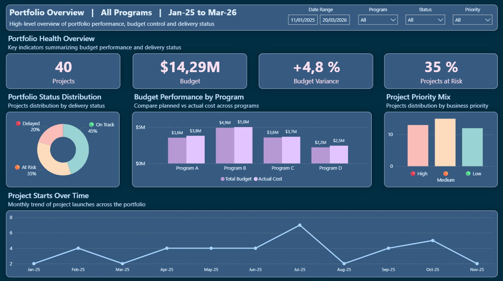
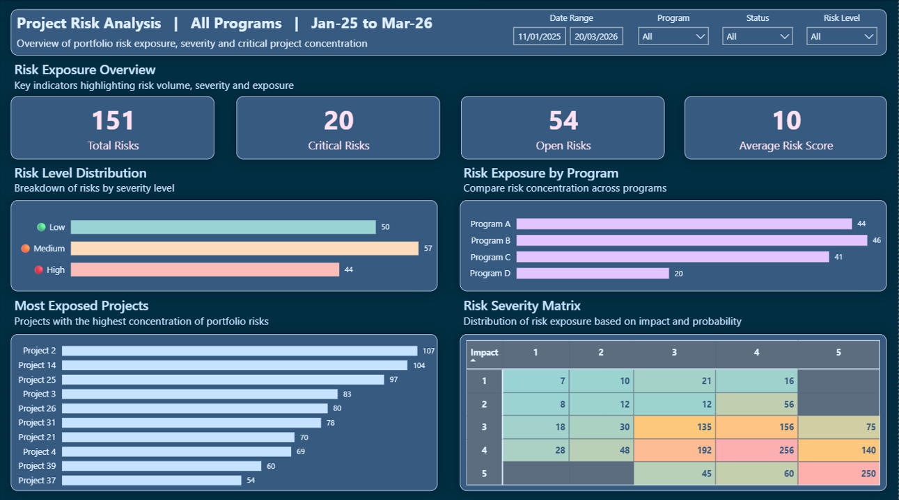
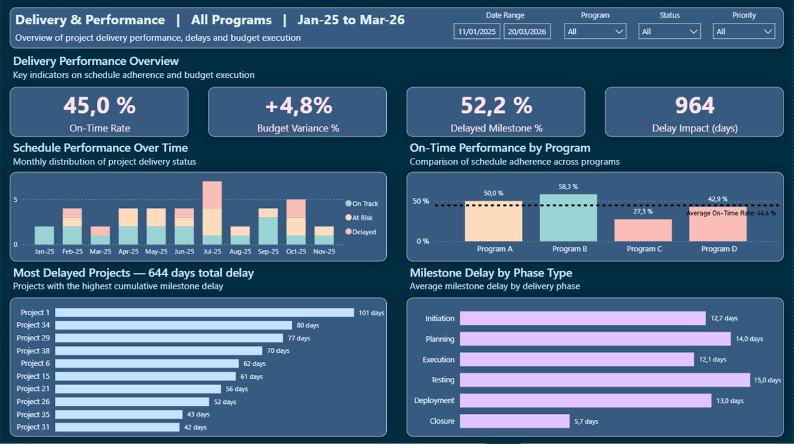
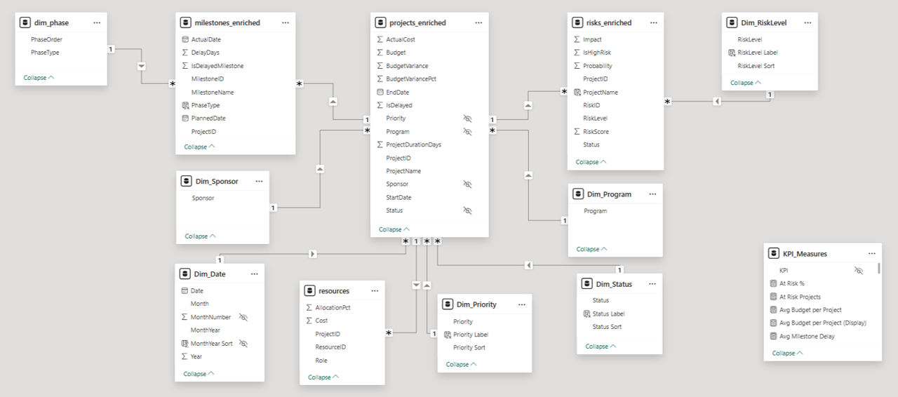

# Project Portfolio Analytics Dashboard

## Business Context
This project was designed as a portfolio management decision-support dashboard for a PMO or transformation office overseeing multiple programs and projects.
The objective is not only to track project status, but to identify where delivery risk is concentrated, which programs require escalation and which project phases contribute most to delays.

## Objective
Build a Power BI dashboard that helps decision-makers answer three critical questions:
1. Which programs are underperforming on delivery?
2. Where is risk concentrated across the portfolio?
3. Which projects and milestone phases should be prioritized for corrective action?

## Target Audience
- PMO analysts
- Portfolio managers
- Program directors
- Transformation leaders

## Analytical Scope
The dashboard covers three complementary dimensions of portfolio performance:
- Delivery performance
- Risk exposure
- Budget and delay impact

## Key KPIs
- On-time delivery rate: share of projects delivered on or before target date
- Budget variance: difference between actual and planned budget
- Delay impact: cumulative delay generated by late projects
- High-risk project ratio: share of projects flagged as high risk
- Top delay contributors: projects accounting for the largest share of total delay impact

## Data Preparation Workflow
1. Generate realistic portfolio data using Python
2. Run sanity checks across projects, milestones and risks
3. Enrich the datasets for reporting use cases
4. Build the data model in Power BI
5. Design KPI-driven dashboard pages for executive and operational analysis

## Dashboard Pages
### Portfolio Overview
Executive view of portfolio size, on-time delivery, budget variance and program-level performance.

### Risk Analysis
Analysis of risk concentration, high-risk projects and prioritization opportunities.

### Delivery Performance
Analysis of delay drivers, milestone bottlenecks and the projects contributing most to delivery underperformance.

## Key Insights
- Delivery performance is uneven across programs, with Program C performing below the portfolio average.
- A limited share of projects drives most of the total delay impact, suggesting strong prioritization opportunities.
- Planning and Testing phases contribute disproportionately to delays, indicating likely process bottlenecks.
- Budget performance is more stable than delivery performance, suggesting that delays are driven more by operational execution than by financial overrun.

## Recommendations
- Prioritize corrective action on the top delayed projects rather than spreading attention evenly across the portfolio.
- Review milestone governance in Planning and Testing phases to reduce repeated execution bottlenecks.
- Use targeted program reviews for underperforming areas instead of portfolio-wide generic escalation.
- Track delivery and risk indicators together to anticipate execution slippage earlier.

## Data Model
The model follows a star schema structure.

Fact tables: 
- Projects
- Milestones
- Risks

Dimension tables: 
- Date
- Program
- Phase
- Status

This structure supports KPI consistency, scalable filtering and drill-down analysis.
The dashboard relies on a relational model connecting projects, milestones, risks, and resources to support portfolio-level analysis.

## Tools Used
- Power BI
- DAX
- Python
- Pandas
- GitHub

## Skills Demonstrated
- KPI design for portfolio management
- Power BI dashboard development
- Star schema modeling
- Business-oriented data storytelling
- Python-based data preparation
- Risk and delivery performance analysis

## Project Structure
- /dashboard -> Power BI file (.pbix)
- /data -> CSV datasets
- /analysis -> Python scripts
- /images -> dashboard & data model screenshots

## Tools & Technologies
- Power BI (data visualization)
- Python (data generation & preprocessing)
- Pandas (data transformation)
- GitHub (versioning & portfolio)

## Notes
This project uses simulated data for demonstration purposes. The emphasis is on analytical reasoning, dashboard design and business interpretation.
