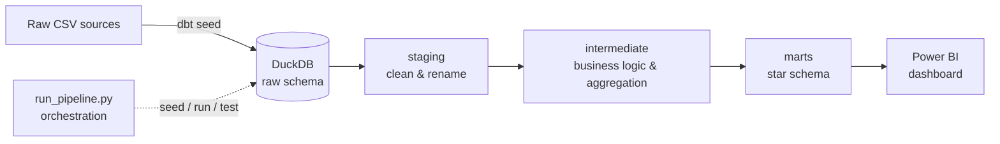

# Project Portfolio Analytics Dashboard

End-to-end analytics project that turns raw project-portfolio data into a decision-ready Power BI dashboard, built on a modern **ELT pipeline** with **dbt**, **DuckDB**, layered data modeling, data quality tests, and lightweight orchestration.

> **This is v2 of the project.** The original version (a Power BI dashboard powered by a Python/Pandas preprocessing workflow) is preserved on the [`v1-powerbi-pandas`](../../tree/v1-powerbi-pandas) branch and as [release `v1.0`](../../releases/tag/v1.0). See [Project Evolution](#project-evolution-v1--v2) below.

---

## Project Evolution (v1 → v2)

This project was intentionally rebuilt to demonstrate the move from a simple reporting workflow to a proper analytics-engineering pipeline.

| | v1 (initial version) | v2 (current version) |
|---|---|---|
| Data preparation | Python + Pandas scripts writing enriched CSVs | **ELT pipeline with dbt** (SQL, layered models) |
| Storage | Flat CSV files | **DuckDB** analytical database |
| Transformations | Ad-hoc pandas enrichment | **Layered models**: staging → intermediate → marts |
| Data quality | Manual sanity checks | **29 automated dbt tests** (unique, not_null, accepted_values, relationships) |
| Modeling | Implicit | Explicit **dimensional model** (star schema) |
| Automation | Manual | **Orchestration script + Windows Task Scheduler** |
| BI layer | Power BI on CSVs | Power BI on the **dbt/DuckDB marts** |

The goal of v2 is to show the ability to build the **upstream analytical layer** — not just the dashboard — from raw source to curated, tested, reporting-ready data.

---

## What This Project Demonstrates

- Designing a layered **ELT pipeline** (raw → staging → intermediate → marts) with dbt.
- **Dimensional modeling** (fact and dimension tables, star schema).
- **Data quality** enforcement through automated tests.
- **Lightweight orchestration** with sequencing, error handling, logging, and scheduling.
- **End-to-end BI integration**: connecting a dbt/DuckDB model to Power BI without breaking an existing report.

---

## Business Context & Objective

This project simulates a **PMO (Project Management Office) reporting environment** managing a portfolio of 40 projects across several programs. It turns operational project data into a decision-support tool that answers three practical questions:

1. Which programs are underperforming on delivery and budget?
2. Where is risk concentrated across the portfolio?
3. Which projects or milestone phases should be prioritized for corrective action?

The dashboard is designed for portfolio-level decision-making — helping PMO analysts, portfolio managers, and program leaders focus attention where operational pressure is highest.

---

## Key KPIs

- **On-track rate** — share of projects delivering on schedule
- **Budget variance (%)** — actual vs. planned cost across the portfolio
- **Delayed projects / milestones** — schedule slippage volume
- **Average milestone delay (days)** — execution pressure indicator
- **Risk exposure** — count and severity of risks, high-risk concentration
- **Resource allocation** — workload distribution and delivery pressure per project

---

## Architecture


```mermaid
flowchart LR
    A[Raw CSV sources] -->|dbt seed| B[(DuckDB<br/>raw schema)]
    B --> C[staging<br/>clean & rename]
    C --> D[intermediate<br/>business logic & aggregation]
    D --> E[marts<br/>star schema]
    E --> F[Power BI<br/>dashboard]
    G[run_pipeline.py<br/>orchestration] -.seed / run / test.-> B
```

**Flow:** raw CSVs are loaded into DuckDB as seeds, then transformed through three dbt layers, exposed as a star schema, and consumed by Power BI.

---

## Tech Stack

- **dbt Core** + **dbt-duckdb** — ELT transformations, tests, documentation
- **DuckDB** — local analytical database (zero-server)
- **Python** (pandas, duckdb) — source data generation, Power BI connection bridge, orchestration
- **Power BI** — semantic model and interactive dashboard
- **Windows Task Scheduler** — scheduled pipeline runs
- **Git / GitHub** — versioning and portfolio

---

## dbt Layers

The pipeline is organized in three layers with clear responsibilities.

### `staging` (materialized as views)
One model per source, doing **only** cleaning and standardization (snake_case renaming, type casting). No business logic.
- `stg_projects`, `stg_milestones`, `stg_risks`, `stg_resources`

### `intermediate` (materialized as views)
First business logic and aggregations.
- `int_projects` — budget variance, project duration, delay flag
- `int_milestones`, `int_risks`, `int_resources` — metrics aggregated **per project**
- `int_milestones_detail`, `int_risks_detail` — enriched detail grain (one row per milestone / risk)

### `marts` (materialized as tables)
Final, reporting-ready dimensional model.
- `dim_project` — descriptive attributes (name, program, sponsor, priority)
- `fct_project_summary` — project-level measures (budget, variance, risks, milestones, resources)

---

## Data Model

A simple **star schema**: a fact table (`fct_project_summary`) referencing a dimension (`dim_project`) on `project_id`.


---

## Business Assumptions

- A project is flagged **delayed** when its status is `Delayed`.
- A milestone is **late** when its actual date is past its planned date (`delay_days > 0`).
- **Risk score** is defined as `impact × probability`; a risk is **high** when its level is `High`.
- Budget variance is `actual_cost − budget`; a positive value means an overrun.

---

## Example Analytical Rule

A project's **delivery pressure** combines three signals available in `fct_project_summary`: budget overrun (`budget_variance_pct`), schedule slippage (`delayed_milestones`, `avg_delay_days`), and risk exposure (`high_risk_count`, `avg_risk_score`). Projects scoring high on several of these at once are the ones surfaced for corrective action in the dashboard.

---

## Data Quality

The pipeline includes **29 automated dbt tests**, covering:
- `unique` and `not_null` on primary keys across all layers
- `accepted_values` on categorical fields (status, priority, risk level)
- `relationships` (referential integrity between `fct_project_summary` and `dim_project`)

Run them with:

```bash
dbt test
```

---

## Orchestration

`run_pipeline.py` runs the full pipeline (`dbt seed` → `dbt run` → `dbt test`) with:
- **sequencing** (each step in order),
- **error handling** (stops immediately if a step fails),
- **timestamped logging** to both the console and `logs/pipeline.log`.

It can be scheduled to run automatically via **Windows Task Scheduler** (a `run_pipeline.bat` wrapper is provided).

```bash
python run_pipeline.py
```

---

## Dashboard

The Power BI report is connected to the dbt marts through a Python bridge (`power_bi_source.py`, which reads DuckDB in read-only mode) and includes the following pages:

- **Portfolio Overview** — portfolio health, status distribution, budget control
- **Risk Analysis** — risk exposure, severity, most exposed projects
- **Delivery & Performance** — schedule adherence, delays, budget execution

### Screenshots

**Portfolio Overview**


**Risk Analysis**


**Delivery & Performance**


---

## Key Insights & Recommendations

- Delivery risk is **concentrated in a small number of projects** that combine budget overruns, milestone delays, and high-severity risks — these should be prioritized for corrective action.
- **Milestone delays vary by delivery phase**, pointing to specific stages where execution support is most needed.
- Budget variance is **not evenly distributed across programs**, helping target financial oversight where it matters most.

> Insights are illustrative and based on simulated data; the value of the project is the repeatable analytical workflow, not the specific figures.

---

## Reproducibility

```bash
# 1. Create and activate a virtual environment, then install dependencies
python -m venv .venv
.venv\Scripts\Activate.ps1
pip install -r requirements.txt

# 2. Build and test the pipeline
cd portfolio_analytics
dbt seed
dbt run
dbt test

# (or run everything at once, from the repo root)
python run_pipeline.py
```

The DuckDB database (`data/portfolio.duckdb`) is fully regenerable from the source CSVs, so it is not versioned.

To connect Power BI: **Get Data → Python script**, and paste the contents of `power_bi_source.py`.

---

## Project Structure

```
project-portfolio-analytics-dashboard/
├── portfolio_analytics/          # dbt project
│   ├── dbt_project.yml
│   ├── profiles.yml
│   ├── seeds/                    # raw source CSVs
│   └── models/
│       ├── staging/
│       ├── intermediate/
│       └── marts/
├── data/                         # source CSVs (DuckDB db is gitignored)
├── images/                       # dashboard & data-model screenshots
├── run_pipeline.py               # orchestration script
├── run_pipeline.bat              # Task Scheduler wrapper
├── power_bi_source.py            # DuckDB → Power BI bridge
├── explore_duckdb.py             # ad-hoc DuckDB exploration
├── requirements.txt
├── 1_generate_portfolio_data.py  # source data generation (project origin)
├── 2_sanity_checks.py            # legacy (v1)
├── 3_enrich_data.py              # legacy pandas enrichment (v1, superseded by dbt)
└── project-portfolio-analytics-dashboard.pbix
```

---

## Skills Demonstrated

- ELT pipeline design with dbt (layered modeling, `ref()`, materializations)
- Advanced SQL (CTEs-friendly logic, window-free aggregations, joins, `coalesce`, date functions)
- Dimensional modeling (fact/dimension, star schema, grain)
- Data quality testing and referential integrity
- Orchestration (sequencing, error handling, logging, scheduling)
- End-to-end BI integration with Power BI
- Git-based versioning and portfolio presentation

---

## Evolution Toward Production

This project runs fully locally (DuckDB + a lightweight orchestration script + Windows Task Scheduler), which is ideal for a self-contained, reproducible portfolio. Because the dbt models are **warehouse-agnostic**, the same design scales onto a production stack with minimal changes to the modeling logic. Two realistic paths:

### Path A — Modern data stack

- **Storage:** replace DuckDB with **Snowflake** (or BigQuery) — the cloud equivalent of the local analytical database.
- **Transformations:** run the same dbt models against the cloud warehouse (only the dbt adapter changes).
- **Orchestration:** replace `run_pipeline.py` + Task Scheduler with **Apache Airflow** (DAGs, dependencies, retries, monitoring) — the production-grade version of the orchestration logic already implemented here.
- **BI:** Power BI (or Looker) on top of the curated marts.

### Path B — Microsoft-native (Fabric)

- **Storage:** a Fabric **Lakehouse / Warehouse** instead of DuckDB.
- **Transformations:** the same dbt models against the Fabric warehouse.
- **Orchestration:** **Fabric Data Pipelines** for scheduling, monitoring, and alerting.
- **BI:** Power BI connected natively to the Fabric semantic model.

In both cases, the layered, tested, dimensional design stays identical — only the underlying platform and orchestrator change. This is exactly why the pipeline was built tool-agnostically with dbt.

---

## Notes

- The dataset is **simulated** for demonstration purposes.
- The DuckDB database and dbt build artifacts are regenerable and therefore excluded from version control.
