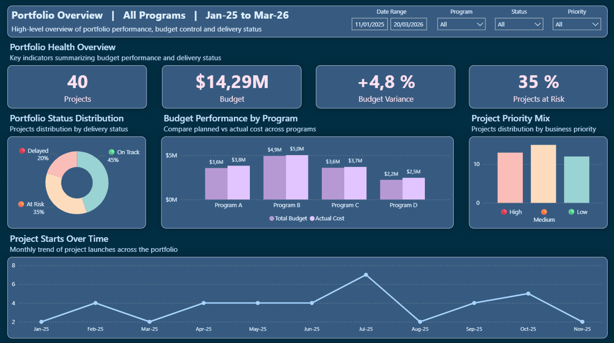
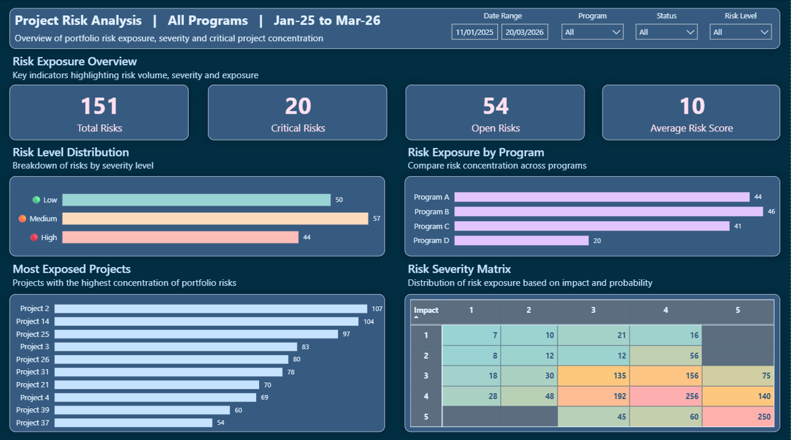
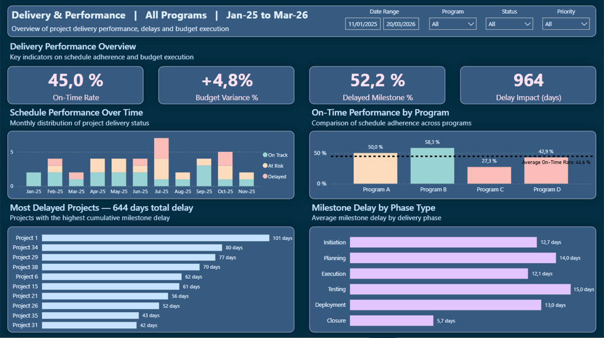
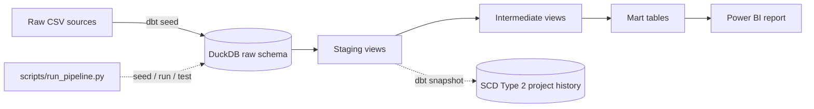
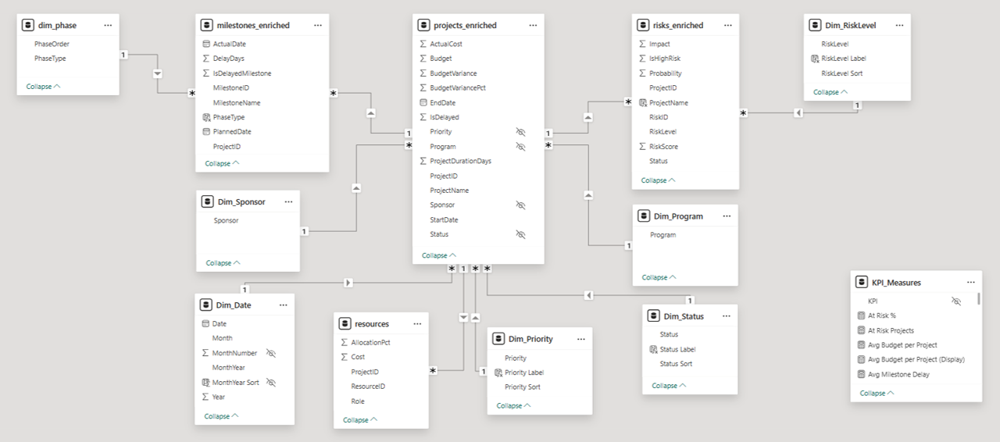
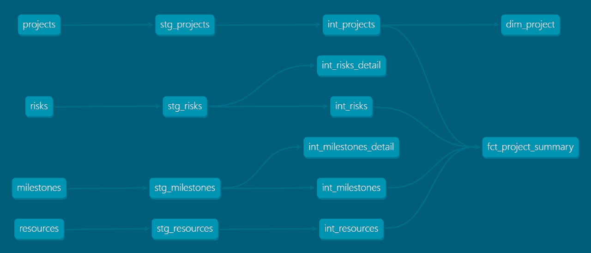

# Project Portfolio Analytics Dashboard

A simulated PMO portfolio dashboard backed by a tested dbt + DuckDB ELT pipeline. The project evolves an existing Power BI report from CSV-based preparation to a layered analytics-engineering workflow.

**Current version:** V2, dbt + DuckDB + Power BI. The original pandas workflow is preserved on the [`v1-powerbi-pandas`](../../tree/v1-powerbi-pandas) branch and in [release `v1.0`](../../releases/tag/v1.0).

**[Live dbt documentation and lineage graph](https://anne-d-wic.github.io/project-portfolio-analytics-dashboard/)**

## Dashboard Screenshots

The report supports portfolio-level review across project health, risk, delivery, and performance.

**Portfolio Overview**


**Risk Analysis**


**Delivery & Performance**


## Project Evolution: V2 First

| Dimension | V2: Current | V1: Original |
|---|---|---|
| Data preparation | dbt ELT transformations in SQL | Python + pandas scripts producing enriched CSVs |
| Storage | DuckDB analytical database | Flat CSV files |
| Modeling | Staging, intermediate, and marts layers; star schema | Implicit model in Power BI |
| Data quality | **34 dbt tests**, including business checks and `dbt-utils` range tests | Manual sanity checks |
| Automation | Python orchestration + Windows Task Scheduler | Manual execution |
| BI | Existing Power BI report connected to dbt/DuckDB models | Power BI report connected to CSVs |

V2 extends the original dashboard with the upstream data layer: raw CSVs are loaded, transformed, tested, and made reporting-ready without rebuilding the report's pages or measures.

## Business Context

The simulated portfolio contains 40 projects across several programs. The dashboard helps PMO analysts, portfolio managers, and program leads answer:

- Which programs are underperforming on delivery or budget?
- Where is risk concentrated?
- Which projects or milestone phases need corrective action?

**Key measures:** on-track rate, budget variance, delayed projects and milestones, average milestone delay, risk exposure, and resource allocation.

**Illustrative findings:** delivery risk is concentrated in projects combining overruns, milestone delays, and high-severity risks; milestone delays vary by phase; budget variance differs across programs. These insights are based on simulated data, so the value is the repeatable analytical workflow rather than the figures themselves.

<details>
<summary><strong>Technical details: architecture, data modeling, quality, and reproducibility</strong></summary>

### Architecture


```mermaid
flowchart LR
    A[Raw CSV sources] -->|dbt seed| B[(DuckDB raw schema)]
    B --> C[Staging views]
    C --> D[Intermediate views]
    D --> E[Mart tables]
    E --> F[Power BI report]
    C -.dbt snapshot.-> G[(SCD Type 2 project history)]
    H[scripts/run_pipeline.py] -.seed / run / test.-> B
```

### Data Model and dbt Layers

The reporting model is a simple star schema: `fct_project_summary` contains project-level measures and references `dim_project` by `project_id`.



- **Staging views:** `stg_projects`, `stg_milestones`, `stg_risks`, `stg_resources` standardize names and types without business logic.
- **Intermediate views:** `int_projects` derives budget variance, project duration, and delay status. Aggregated models summarize milestones, risks, and resources by project; detail models retain one row per milestone or risk for Power BI.
- **Marts:** `dim_project` holds descriptive project attributes; `fct_project_summary` combines project-level budget, risk, milestone, and resource measures.

Business rules include `budget_variance = actual_cost - budget` (positive means over budget), milestone delay when `delay_days > 0`, and risk score as `impact * probability`.

### Data Quality and History

The project has **34 automated dbt tests**:
- `unique`, `not_null`, `accepted_values`, and `relationships` checks
- Three singular SQL tests for milestone date/delay consistency and aggregate reconciliation of delayed milestones and high risks
- `dbt-utils` `accepted_range` checks requiring risk impact and probability to be between 1 and 5

The `projects_snapshot` snapshot uses the **check** strategy and `project_id` as its key. It tracks changes in `status`, `priority`, `actual_cost`, and `end_date`, preserving versions with `dbt_valid_from` and `dbt_valid_to`. It runs separately from the seed/run/test pipeline. Since source CSVs are static, a snapshot records a change only when the source relation changes between snapshot runs.

Run the test suite from `portfolio_analytics`:

```powershell
dbt test
```

### Documentation and Lineage

The [published dbt docs](https://anne-d-wic.github.io/project-portfolio-analytics-dashboard/) expose models, columns, tests, compiled SQL, and lineage derived from `ref()` calls. Business descriptions currently focus on the marts and selected metrics.



The detail models `int_risks_detail` and `int_milestones_detail` are separate terminal paths because Power BI needs their atomic grain; aggregated models feed `fct_project_summary`.

Regenerate the static documentation from `portfolio_analytics` after changing models or metadata, then copy it into `docs/`:

```powershell
dbt docs generate --static
Copy-Item target\static_index.html ..\docs\index.html -Force
```

### Orchestration

`scripts/run_pipeline.py` runs `dbt seed`, `dbt run`, and `dbt test` in sequence. It stops on failure and writes timestamped output to the console and `logs/pipeline.log`. Paths are resolved relative to the repository root, so it can be launched from any working directory. `scripts/run_pipeline.bat` is the Windows Task Scheduler wrapper. The scheduled pipeline does not run snapshots.

### Reproduce Locally

From the repository root, create the Python environment and install dependencies:

```powershell
python -m venv .venv
.venv\Scripts\Activate.ps1
python -m pip install -r requirements.txt
```

Then install dbt packages, build the models, capture the initial snapshot, and run tests:

```powershell
cd portfolio_analytics
dbt deps
dbt seed
dbt run
dbt snapshot
dbt test
```

For the daily seed/run/test pipeline, return to the repository root and run:

```powershell
cd ..
python scripts/run_pipeline.py
```

The DuckDB database (`data/portfolio.duckdb`) and dbt build artifacts are regenerable and are not versioned.

### Power BI Python Connection

In Power BI Desktop, use **Get Data → Python script** and paste `scripts/power_bi_source.py`. Power BI runs the interpreter selected in **Options → Global → Python scripting**, which may differ from `.venv`. Install the bridge dependencies into that selected Python interpreter; Power BI also imports `matplotlib` when running the script:

```powershell
python -m pip install "duckdb==1.5.4" "pandas==2.2.3" "matplotlib==3.11.2"
```

Power BI executes the pasted code outside a file, so `__file__` is unavailable. Configure `PORTFOLIO_DB_PATH` to the full path of `data/portfolio.duckdb`, or edit the fallback path in the script. To set a persistent Windows user variable, replace the example path and run:

```powershell
[Environment]::SetEnvironmentVariable("PORTFOLIO_DB_PATH", "C:\path\to\project-portfolio-analytics-dashboard\data\portfolio.duckdb", "User")
```

Restart Power BI after changing the environment variable. The database connection is read-only so the report can read while dbt writes.

### Project Structure

```text
project-portfolio-analytics-dashboard/
├── portfolio_analytics/   # dbt project, packages, models, snapshots, tests, seeds
├── scripts/               # orchestration, Power BI bridge, DuckDB exploration
├── legacy_v1/             # original pandas workflow
├── data/                  # source CSVs; DuckDB database is gitignored
├── images/                # dashboard, data model, and lineage screenshots
├── docs/                  # static dbt documentation for GitHub Pages
├── powerbi/               # Power BI report
├── requirements.txt
└── README.md
```

### Stack and Possible Evolution

The project uses dbt Core, dbt-duckdb, DuckDB, Python, Power BI, GitHub, and Windows Task Scheduler. Its layered and tested model is a foundation that could be adapted to a production stack; SQL dialects, adapters, and platform-specific behavior may require changes.

- **Modern data stack:** Snowflake or BigQuery, dbt, and an orchestrator such as Apache Airflow.
- **Microsoft-native:** Fabric Lakehouse or Warehouse, Fabric Data Pipelines, and Power BI.

These are potential next steps, not technologies implemented in this project.
</details>
